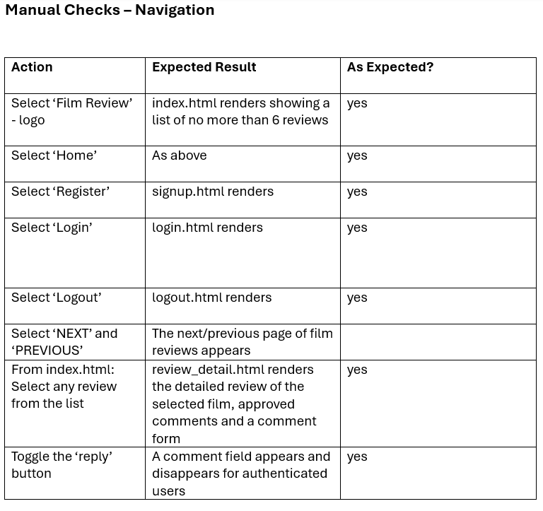
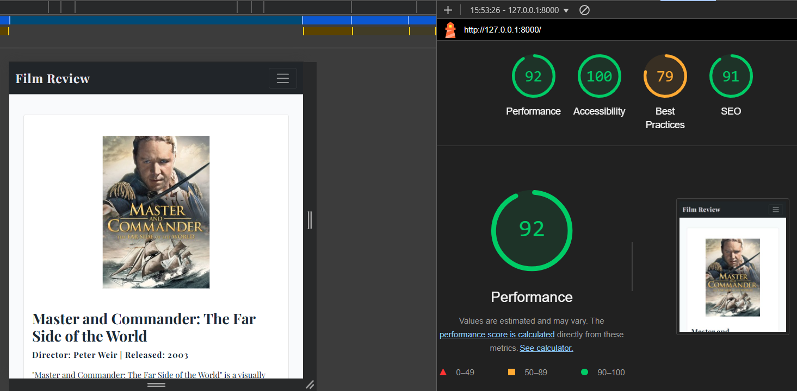
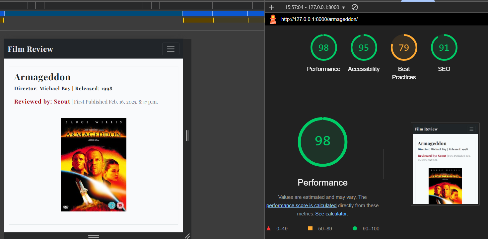

# film-review

## Testing

### HTML
The method of testing the html files was as follows:
- Run the development site using ```python manage.py runserver```
- Right click on the page to be validated and select 'View Page Source'
- Copy and paste html into W3C validator

This approach enabled the validation of the html without interference from the Django Template Tags, and allowed for the quick fixing of errors before deployment. The file base.html is validated by extension of assessing the rendered pages.

A summary of the results are shown in the table below:


### CSS
No errors or warnings were shown when entering the style.css file content into the W3C Validation Service.


### JavaScript
No errors were found when entering the script.js file content into jshint.


### Python
The python code was tested using Code Institute's Python Linter tool, a visual confirmation of docstring inclusion and the use of tests.py for automated testing. The results are summarized below

#### Python Linter and Docstrings


#### Automated Python Testing
The following automated tests were defined within and run from tests.py:
- Test that the string representation of Review model is correct.
- Test that a new review has default status of draft (0).
- Test that the string representation of Comment model is correct.
- Test that the review list view returns correct response and template.
- Test that the review detail view returns correct response and template.
- Test that a user can edit their own comment successfully.
- Test that a user can delete their own comment successfully.
- Test that a different user cannot delete someone else's comment.
- Test that the home URL resolves correctly.
- Test that the review detail URL resolves correctly with a slug.

The following image shows that all automated tests were passed.


### Manual Testing
In addition to the validation and automated testing completed and defined above, the following manual tests were conducted:



### Lighthouse Analysis
Lighthouse analysis was completed on two pages that have the potential for heavy loads and performance degradation; index.html and review_detail.html. 

Both these pages demonstrated high Performance, Accessibility and SEO scores but a reduced Best Practice score due to Cloudinary not using HTTPS. This practice is beyond the developer's control.

The following screenshots show the results of the Lighthouse analysis, completed using a Chrome web browser in Incognito mode:

#### index.html



#### review_detail.html



### User Story Analysis

The User Stories were checked for completeness and the results summarized in the table below:


## Issues
### User Story #9 - Vote on Comments
This feature was aborted during development due to an unresolved issue.

I was able to develop the ability for a user to allocate one 'up' or 'down' vote to comments, but was unable to reconcile the ability of a user to change their vote at a later date if they wished.

Finding myself running out of time, and learning from previous experience, I drew a line under this feature and returned the User Story to the first column of the Kanban board. My intention was to return to this User Story only if time permitted. Time did not permit and this undeveloped feature is now a follow-on action recommendation.

## Follow-on Action Recommendations

The following list represents additional features and functions that could be added to this website at a later date:

- User Story #9 Vote on Comments
- Email confirmation upon user registration
- Additional app and models for detailing biographies of the authors
- Additional app and models for detailing biographies of the directors
- AI integration for helping users find where a film is currently playing or streaming
- User generated rating feature for films

## Deployment

The project was deployed on Heroku using the following steps:

### Within VS Code:

- Install gunicorn for use as a Web Server Gateway Interface (WSGI)
- Create a Procfile to specify gunicorn as the WSGI when the project is deployed on Heroku
- Update ALLOWED_HOSTS in settings.py with the project host's details
- Git add, commit and push

### On Heroku

- Create and name a new app using European Common Runtime
- From within 'Settings', 'Reveal Config Vars' and add sensitive information
- From within 'Deploy', select 'GitHub', search for the repository to connect to, then select 'Connect'
- Scroll to find the section titled 'Manual Deploy', select 'Main' from the dropdown menu, then select 'Deploy Branch'
- Once the build has finished, select 'Open App' to view the deployed project

## Main Packages

- Django - for high-level, front-end and back-end web application development
- Gunicorn - a WSGI server for UNIX, suitable for scaling Python web applications
- Whitenoise - for efficient static file serving with compression and caching
- dj-database-url - simplifies database configuration using environment variables
- psycopg2 - PostgreSQL adapter for Python, providing robust database connectivity
- summernote - What You See Is What You Get (WYSIWYG) admin panel editor
- django-allauth - a library for managing User Account registration and management
- django-crispy-forms - a library for creating and managing forms
- crispy-bootstrap5 - a template pack to integrate Crispy Forms with Bootstrap5
- Bootstrap 5 - Front-end toolkit for building websites quickly
- Cloudinary - image hosting and management

## Tools and Resources

- https://imageresizer.com/ - resizing images
- https://validator.w3.org/ - html validator
- https://jigsaw.w3.org/css-validator/validator - CSS Validator
- https://jshint.com/ - jshint
- https://pep8ci.herokuapp.com/ - CI Python Linter