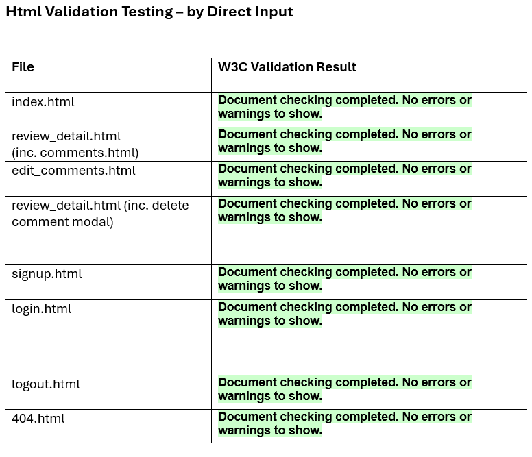

# film-review

## Testing

### HTML
The method of testing the html files was as follows:
- Run the development site using ```python manage.py runserver```
- Right click on the page to be validated and select 'View Page Source'
- Copy and paste html into W3C validator

This approach enabled the validation of the html without interference from the Django Template Tags. The file base.html is validated by extension of assessing the rendered pages.

A summary of the results are shown in the table below:



### CSS
No errors or warnings were shown when entering the style.css file conetent into the W3C Validation Service.


### JavaScript
No errors were found when entering the script.js file content into jshint.


### Python
The python code was tested using Code Institsute's Python Linter tool, a visual confirmation of docstring inclusion and the automated use of tests.py The results are summarised below

#### Python Linter and Docstrings


#### tests.py


## Deployment

The project was deployed on Heroku using the following steps:

### Within VS Code:

- Install gunicorn for use as a Web Server Gateway Interface (WSGI)
- Create a Procfile to specify gunicorn as the WSGI when the project is deloyed on Heroku
- Update ALLOWED_HOSTS in settings.py with the project host's details
- Git add, commit and push

### On Heroku

- Create and name a new app using European Common Runtime
- From within 'Settings', 'Reveal Config Vars' and add sensitive information
- From within 'Deploy', select 'GitHub', search for the repository to connect to, then select 'Connect'
- Scroll to find the section titled 'Manual Deply', select 'Main' from the dropdown menu, then select 'Deploy Branch'
- Once the build has finished, select 'Open App' to view the deployed project

## Main Packages

- Django - for high-level, front-end and back-end web application development
- Gunicorn - a WSGI server for UNIX, suitable for scaling Python web applications
- Whitenoise - for efficient static file serving with compression and caching
- dj-database-url - simplifies database configuration using environment variables
- psycopg2 - PostgreSQL adapter for Python, providing robust database connectivity
- summernote - What You See Is What You Get (WYSIWYA) admin panel editor
- django-allauth - a library for managing User Account regisration and management
- django-crispy-forms - a library for creating and managing forms
- crispy-bootstrap5 - a template pack to integrate Crispy Forms with Bootstrap5
- Bootstrap 5 - Front-end toolkit for building websites quickly
- Cloudinary - image hosting and management

## Tools and Resources

- https://imageresizer.com/ - resizing images
- https://jigsaw.w3.org/css-validator/validator - CSS Validator
- https://jshint.com/ - jshint
- https://pep8ci.herokuapp.com/ - CI Python Linter
