# Film Review

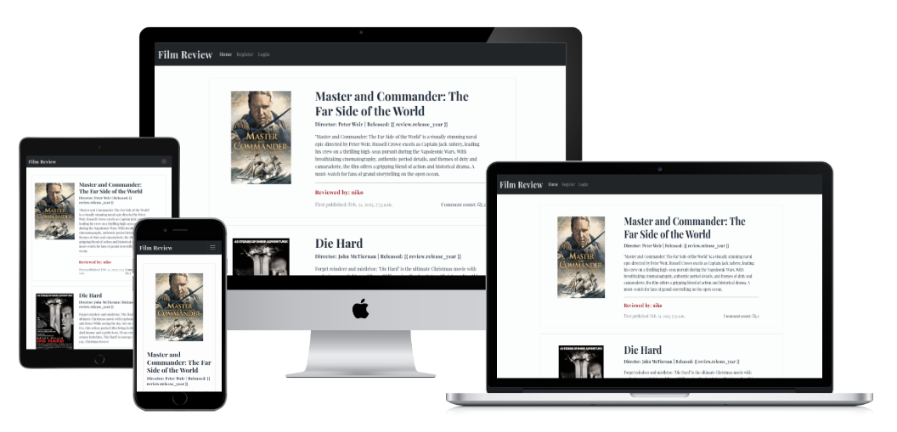

Film Review is a fully responsive, multi-page website designed to enable visitors to read film reviews.

Unregistered users can select and then read reviews from a paginated list and 'Register' an account if they wish.

In addition to reading reviews, registered users can:
- Login to their account
- Comment on reviews
- Comment on other users' comments
- Logout of their accounts

The back-end of this website was developed using the Django web framework to enable the smooth integration of user authentication, database management, and site administration.

The front-end makes use of Django Templates and the Bootstrap framework to create a dynamic, responsive, and visually appealing website that integrates seamlessly with the back-end logic and data.

[View the deployed site here.](https://duffew-film-review-4cd57f5e116c.herokuapp.com/)

## Features

The Film Review website includes the following features:

### Home Page
Including:
- Navigation bar
- Paginated list of film reviews
- Footer

### Film Review Excerpts
Each review excerpt in the list shows:
- Film poster
- Film title
- Director and year of release
- Excerpt text
- Review author
- Date of first publication
- Number of reader comments on the review

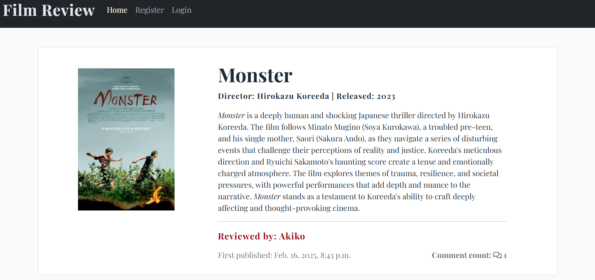

*Homepage showing navigation bar and review excerpt*

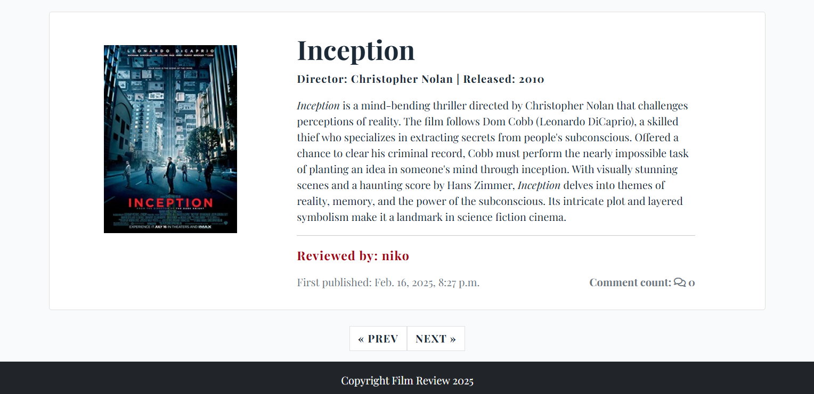
*Homepage showing footer, PREVIOUS and NEXT buttons*

### Detailed Film Reviews
When a user selects a film review to read, they will see a detailed film review page that includes:
- Excerpt information as above minus the excerpt text
- A detailed review of the film
- Reader's comments if any

Authenticated users have extended CRUD permissions, having options to:
- Begin a new comment thread
- Reply to existing comments
- Edit their existing comments
- Delete their existing comments

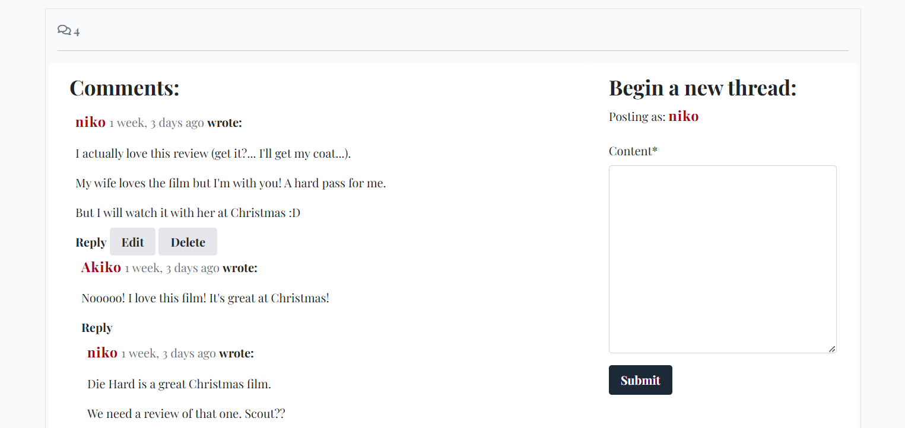
*Comments section of a film review*

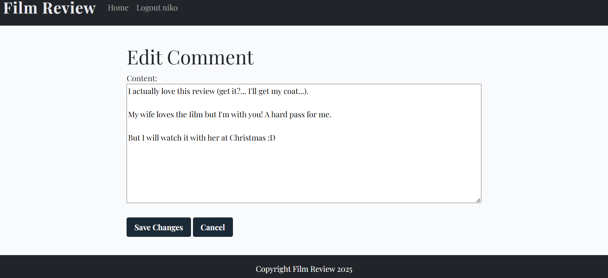
*Edit Comment feature appears on a new page when selected*


*Modal appears for users to confirm comment deletion*

### Registration Page
Unauthenticated users can create an account by providing:
- Username
- Optional email address
- Password within authentication parameters for length and characters

Invalid registration attempts will prompt an error message. User authentication is managed using Django's built-in User Model.

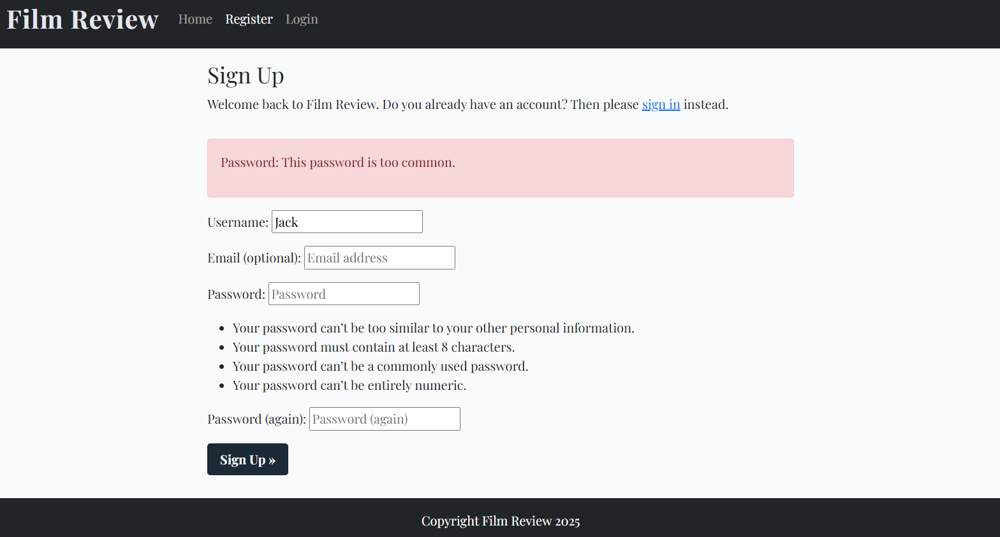
*Registration page with error message*

### Login Page
Authenticated users are able to log in with their Username and Password.

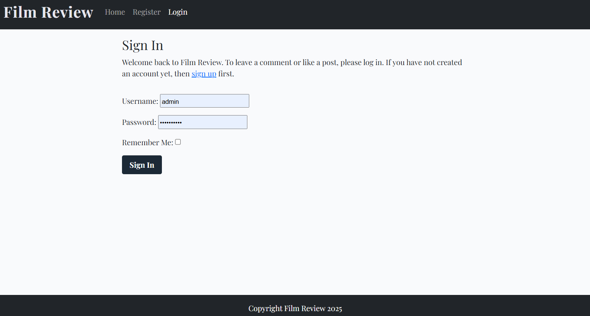
*Login page*

### Logout Page
Authenticated users are able to log out.


*Logout page*

### 404 Page
In case of a page-not-found error, a 404 page will appear.


### Admin Panel
Site administrators are able to manage the authenticated users, reviews, and comments via Django's admin panel.

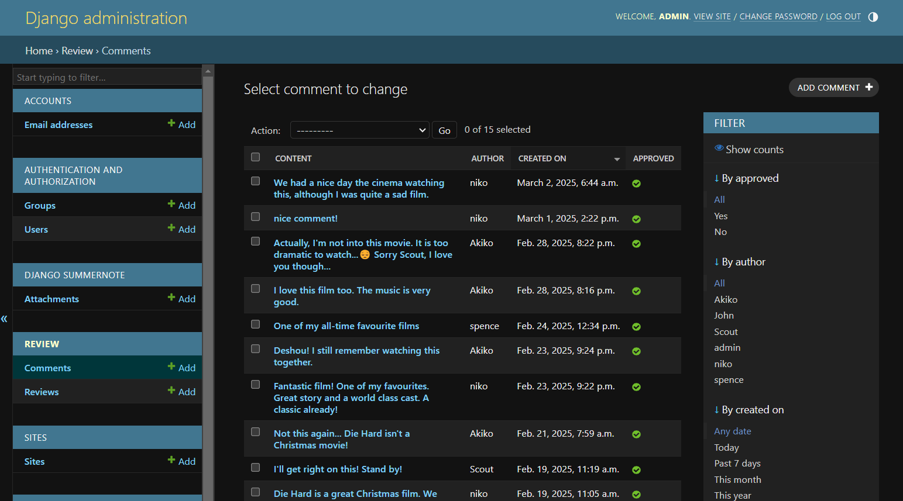
*A list of reader's comments within the admin panel*

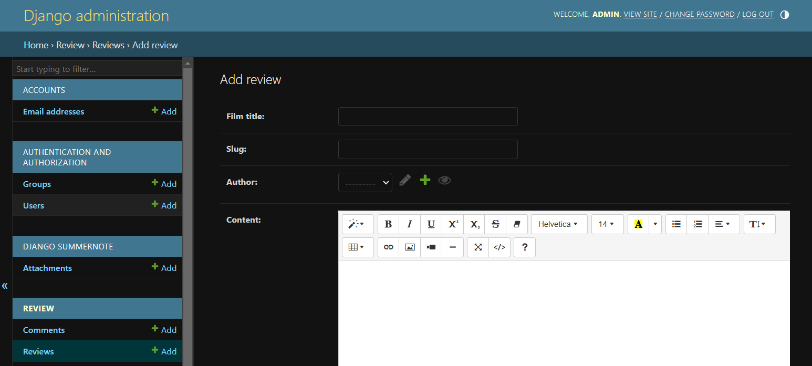
*'Add Review' feature accessible from the admin panel*

Editing within the admin panel makes use of the WYSIWYG editor Summernote for enhanced content creation.

## Development
### Agile
This project employed elements of the Agile approach to product development. In particular, this project identified user requirements within User Stories and tracked progress using a Kanban Board.

#### User Stories
User Stories were used in this project in order to capture user requirements for the website, and then to check that the project had delivered what was expected.

The User Stories were developed according to a template created at the start of the project. The template ensured that User Stories always made reference to:
- The role that has the requirement
- The feature that the role needs
- The benefit of the feature

The User Stories then included a number of acceptance criteria, which could be used to confirm whether the feature had been delivered successfully.

A total of 10 User Stories were created and 9 of those 10 were delivered.

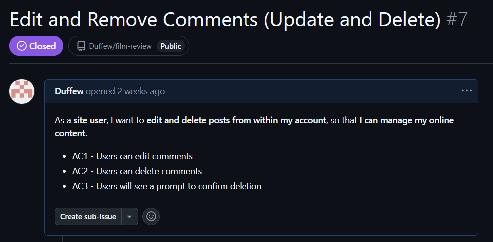
*An example of a User Story used in this project*

#### Kanban Board
Once created, the User Stories were placed on the project's Kanban Board. This enabled the project requirements to be:
- grouped for development purposes
- tracked for progress monitoring purposes
- added to as the project progressed
- reprioritized as the project progressed

The project's Kanban Board can be seen [here](https://github.com/users/Duffew/projects/8/views/1).

### Models
The database for this project made use of two custom models, Review and Comments. The project also made use of Django's built-in User Model to provide out-of-the-box user authentication.

The Entity Relationship Diagrams (ERDs) for the custom models are shown below.

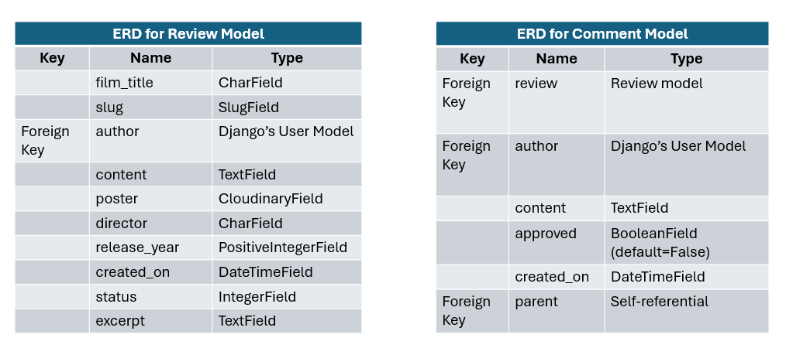
*Entity Relationship Diagrams for Review and Comment custom models*

### Wireframes
This project also made use of hand-drawn wireframes to help plan the layout of web pages on different screen sizes.

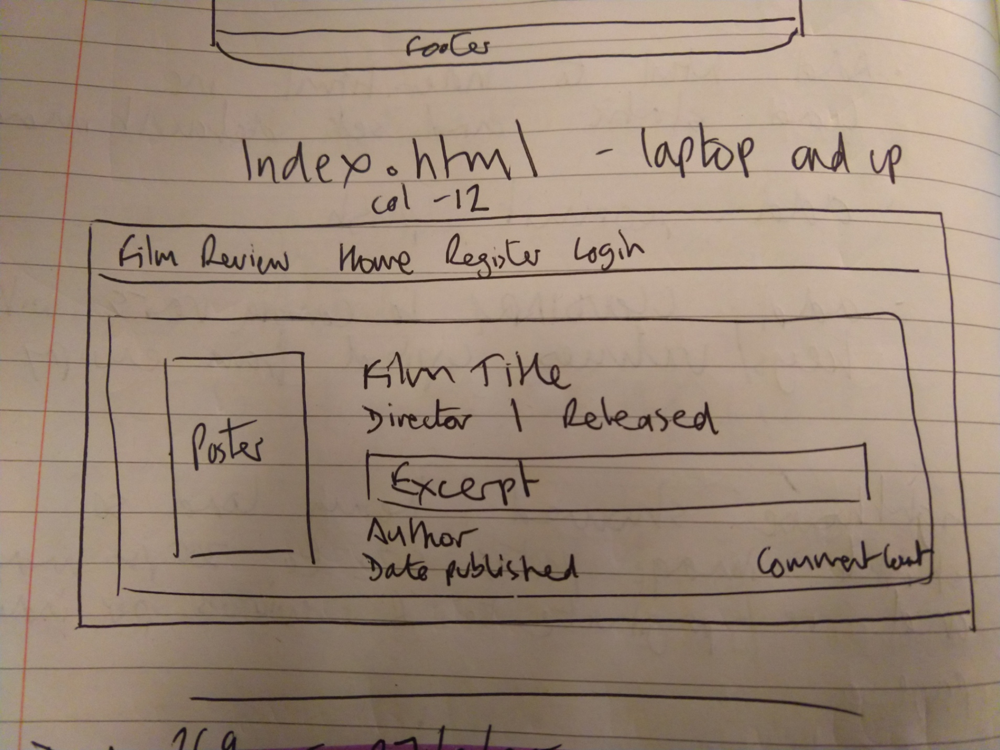
*Wireframe example for large screen sizes*

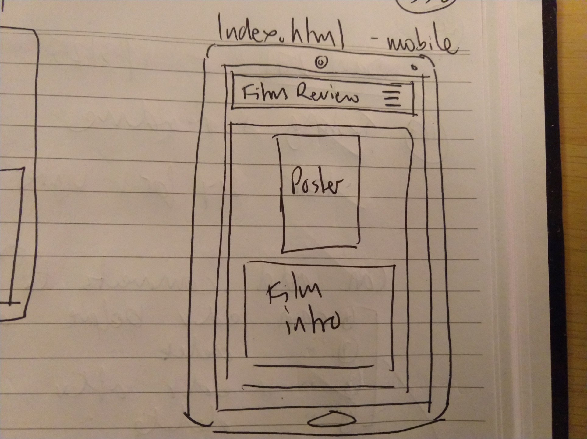
*Wireframe example for mobile screens*

## Testing

### HTML
The method of testing the HTML files was as follows:
- Run the development site using ```python manage.py runserver```
- Right click on the page to be validated and select 'View Page Source'
- Copy and paste HTML into W3C validator

This approach enabled the validation of the HTML without interference from the Django Template Tags, and allowed for the quick fixing of errors before deployment. The file base.html is validated by extension of assessing the rendered pages.

A summary of the results is shown in the table below:


### CSS
No errors or warnings were shown when entering the style.css file content into the W3C Validation Service.


### JavaScript
No errors were found when entering the script.js file content into JSHint.


### Python
The Python code was tested using Code Institute's Python Linter tool, a visual confirmation of docstring inclusion, and the use of tests.py for automated testing. The results are summarized below

#### Python Linter and Docstrings


#### Automated Python Testing
The following automated tests were defined within and run from tests.py:
- Test that the string representation of Review model is correct.
- Test that a new review has default status of draft (0).
- Test that the string representation of Comment model is correct.
- Test that the review list view returns correct response and template.
- Test that the review detail view returns correct response and template.
- Test that a user can edit their own comment successfully.
- Test that a user can delete their own comment successfully.
- Test that a different user cannot delete someone else's comment.
- Test that the home URL resolves correctly.
- Test that the review detail URL resolves correctly with a slug.

The following image shows that all automated tests were passed.


### Manual Testing
In addition to the validation and automated testing completed and defined above, the following manual tests were conducted:


### Lighthouse Analysis
Lighthouse analysis was completed on two pages that have the potential for heavy loads and performance degradation; index.html and review_detail.html.

Both these pages demonstrated high Performance, Accessibility, and SEO scores but a reduced Best Practice score due to Cloudinary not using HTTPS. This practice is beyond the developer's control.

The following screenshots show the results of the Lighthouse analysis, completed using a Chrome web browser in Incognito mode:

#### index.html


#### review_detail.html


### User Story Analysis

The User Stories were checked for completeness and the results summarized in the table below:

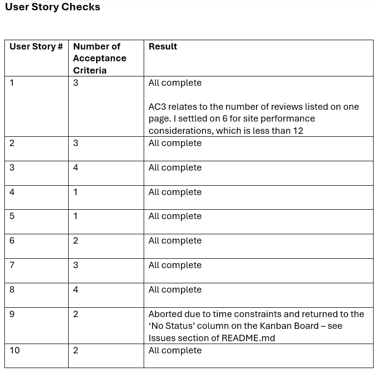

## Issues
### User Story #9 - Vote on Comments
This feature was aborted during development due to an unresolved issue.

I was able to develop the ability for a user to allocate one 'up' or 'down' vote to comments, but was unable to reconcile the ability of a user to change their vote at a later date if they wished.

Finding myself running out of time, and learning from previous experience, I drew a line under this feature and returned the User Story to the first column of the Kanban board. My intention was to return to this User Story only if time permitted. Time did not permit and this undeveloped feature is now a follow-on action recommendation.

## Follow-on Action Recommendations

The following list represents additional features and functions that could be added to this website at a later date:

- User Story #9 Vote on Comments
- Email confirmation upon user registration
- Additional app and models for detailing biographies of the authors
- Additional app and models for detailing biographies of the directors
- AI integration for helping users find where a film is currently playing or streaming
- User-generated rating feature for films

## Deployment

The project was deployed to Heroku using the following steps:

### Within VS Code:

- Install gunicorn for use as a Web Server Gateway Interface (WSGI)
- Create a Procfile to specify gunicorn as the WSGI when the project is deployed on Heroku
- Update ALLOWED_HOSTS in settings.py with the project host's details
- Git add, commit and push

### On Heroku

- Create and name a new app using European Common Runtime
- From within 'Settings', 'Reveal Config Vars' and add sensitive information
- From within 'Deploy', select 'GitHub', search for the repository to connect to, then select 'Connect'
- Scroll to find the section titled 'Manual Deploy', select 'Main' from the dropdown menu, then select 'Deploy Branch'
- Once the build has finished, select 'Open App' to view the deployed project

### Version Control

The website was developed using the VS Code Integrated Development Environment (IDE) and pushed to the Film Review repo on GitHub. The following git commands were used to communicate between the IDE and GitHub:

- ```git add .``` - used to add updates to the staging area ready for committal to the queue
- ```git commit -m "<comment>"``` - used to commit updates to the repo queue
- ```git push``` - used to send updates in the queue to the repo on GitHub

Early on in the development process, the User Story templates were created and committed directly on GitHub. ```git pull``` was then used before merging those commits with the work done on VS Code.

## Technologies
### Languages
- HTML
- CSS
- JavaScript
- Python

### Libraries & Frameworks
- Django - for high-level, front-end and back-end web application development
- Gunicorn - a WSGI server for UNIX, suitable for scaling Python web applications
- Whitenoise - for efficient static file serving with compression and caching
- dj-database-url - simplifies database configuration using environment variables
- psycopg2 - PostgreSQL adapter for Python, providing robust database connectivity
- Summernote - What You See Is What You Get (WYSIWYG) admin panel editor
- django-crispy-forms - a library for creating and managing forms
- crispy-bootstrap5 - a template pack to integrate Crispy Forms with Bootstrap5
- Bootstrap 5 - Front-end toolkit for building websites quickly
- Cloudinary - image hosting and management

## Tools and Resources
### Online
-  [Image Resizing](https://imageresizer.com/)
-  [HTML Validator](https://validator.w3.org/)
-  [CSS Validator](https://jigsaw.w3.org/css-validator/validator)
-  [JSHint](https://jshint.com/)
-  [CI Python Linter](https://pep8ci.herokuapp.com/)

### AI
Artificial Intelligence applications were used in the development of this project. In particular, Copilot and Grok were used for the following purposes:
- Content creation - film review content and excerpts were created by AI by defining the personality of different authors, setting a 500-word limit and a like/dislike prompt
- Debugging - copying and pasting code to help find errors
- Q&A - particularly in the early stages of the project when deepening my understanding as to how the back-end files work together. Also, practical questions about keyboard shortcuts and how to merge commits, for example
- Proofreading

## Credits
- Code from the Code Institute Django Blog walkthrough project was used and is credited within the code where applicable
- All content outside of the film reviews created by the developer
- Massive thanks to my mentor Spencer Barriball for advice ranging from the general to the specific!